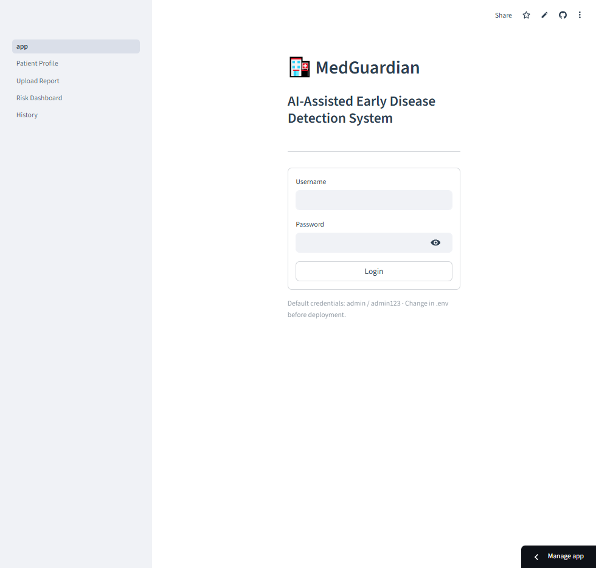

# MedGuardian
## AI-Assisted Early Disease Detection System

**B.Sc. Computer Science — Final Year Project**

**[Your Full Name]** | **[Guide Name]** | **[College Name]** | [2024 – 2025]

---

# Agenda

1. Introduction & Problem Statement
2. Objectives & Scope
3. System Architecture
4. Key Modules
5. Technology Stack
6. Risk Score Formulae
7. Datasets & Sample Reports
8. Demo & Results
9. Deployment (Git & Streamlit Cloud)
10. Limitations & Future Work
11. Conclusion

---

# 1. Introduction

- Chronic conditions (diabetes, hypertension, cholesterol) need early risk detection
- Lab reports are PDFs — text-based or scanned
- Manual data entry is tedious and error-prone
- **MedGuardian** automates extraction and risk computation

---

# 2. Problem Statement

- Extract biomarker values from PDF lab reports
- Support both text-based and scanned PDFs (OCR)
- Compute standardised risk scores for diabetes, BP, cholesterol
- Track trends over time
- Data stored in SQLite on deployment server (no third-party analytics)

---

# 3. Objectives

- Build a Streamlit web app for early disease detection
- Parse PDFs with pdfplumber + Tesseract OCR fallback
- Use regex to extract glucose, HbA1c, BMI, BP, cholesterol
- Apply clinical formulae (ADA, JNC 8, ACC/AHA)
- Provide gauges and trend charts (Plotly)

---

# 4. System Architecture

```
┌─────────────────┐     ┌──────────────────┐     ┌─────────────┐
│  Streamlit UI   │────▶│  Services /      │────▶│   SQLite    │
│  (5 pages)      │     │  Models          │     │   Database  │
└─────────────────┘     └──────────────────┘     └─────────────┘
        │                         │
        │  PDF Upload             │  Risk Scores
        ▼                         ▼
┌─────────────────┐     ┌──────────────────┐
│  PDF Parser +   │     │  Diabetes / BP / │
│  OCR            │     │  Cholesterol     │
└─────────────────┘     └──────────────────┘
```

---

# 5. Key Modules

| Module | Function |
|--------|----------|
| Auth | Session-based login, SHA-256 password hash |
| Patient Profile | CRUD for patients |
| Upload Report | PDF → text → biomarkers → health record |
| Risk Dashboard | Compute & display risk scores |
| History | Trend charts for biomarkers & risk |

---

# 6. Risk Score Formulae

**Diabetes (0–100%):**
- 0.4×glucose_dev + 0.4×hba1c_dev + 0.1×BMI_mod + 0.1×family_history
- Ranges: 0–20% Low, 21–50% Moderate, 51–100% High

**Blood Pressure:** JNC 8 / ACC-AHA 2017

**Cholesterol:** ACC/AHA 2018 (<200, 200–239, ≥240 mg/dL)

---

# 7. Technology Stack

- **Python 3.10+**, **Streamlit**
- **SQLite** (on deployment server)
- **pdfplumber**, **PyMuPDF**, **pytesseract**, **Pillow**
- **Plotly**, **pandas**, **numpy**

---

# 8. Datasets & Sample Reports

- **sample_patients.csv** — 15 demo patients (aligned with report metadata)
- **sample_health_records.csv** — 15 health records (one per patient)
- **15 PDF lab reports** from **5 laboratories** (Care Diagnostics, Apollo, Thyro Lab, Metropolitan, Sunrise)
- **Age groups:** 24–70 yrs (young adult to senior)
- **Risk profiles:** 5 low, 5 moderate, 5 high
- Load sample data from Home page when DB empty; Reset & reload when needed

---

# 9. Demo & Results



- Patient profile creation and CRUD
- PDF upload → text extraction (pdfplumber / OCR)
- Biomarker parsing and user verification; Save Health Record → status: pending → processed
- Risk dashboard with gauge charts
- History: risk trends, biomarker trends, uploaded reports (status: processed / pending / failed)
- Sample data loader (15 patients, 15 records) for empty DB

---

# 10. Deployment (Git & Streamlit Cloud)

**Git upload:**
`git init` → `git add .` → `git commit` → `git remote add origin` → `git push -u origin main`

**Streamlit Cloud:**
Push to GitHub → share.streamlit.io → Create app → Select repo, main file path (`MedGuardian_Project/app.py`) → Add secrets (`ADMIN_PASSWORD_HASH`) → Deploy. App runs at `https://<name>.streamlit.app`

---

# 11. Limitations

- Tesseract must be installed separately; not available on Streamlit Cloud
- Single admin user; no multi-tenancy
- Regex may not cover all lab report formats
- No EHR/LIS integration
- Ephemeral DB on Streamlit Cloud; load sample data after each cold start

---

# 12. Future Work

- More biomarkers (triglycerides, LDL, HDL, creatinine)
- Multi-user roles (admin, clinician, patient)
- Export reports to PDF
- Integration with lab information systems
- Mobile responsiveness

---

# 13. Conclusion

MedGuardian delivers an **AI-assisted early disease detection** system that:
- Parses PDF lab reports (text + OCR)
- Extracts biomarkers automatically
- Detects early disease risk (diabetes, hypertension, cholesterol)
- Stores data in SQLite on deployment server
- Provides gauge charts and trend visualisation
- Supports 15 sample reports from 5 laboratories

**Thank You**

---

# Q & A

**Contact:** [Your Full Name]  
**Roll No:** [Your Roll No]  
**Guide:** [Guide Name]
